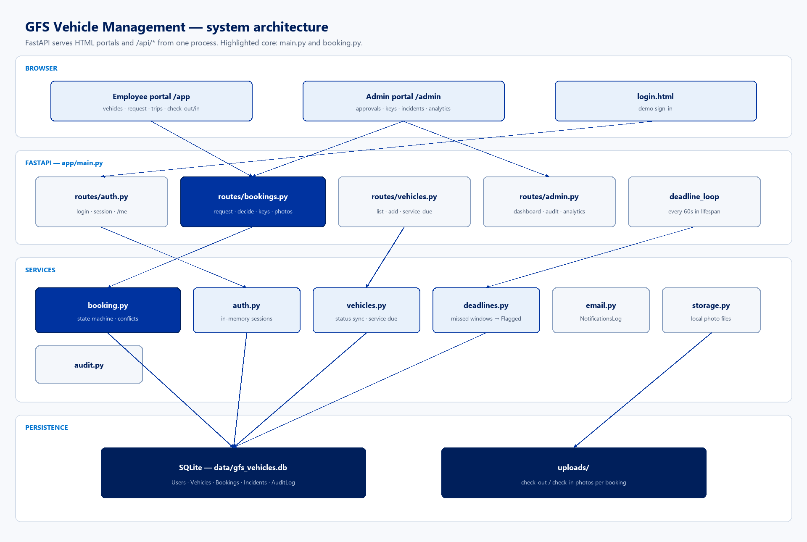
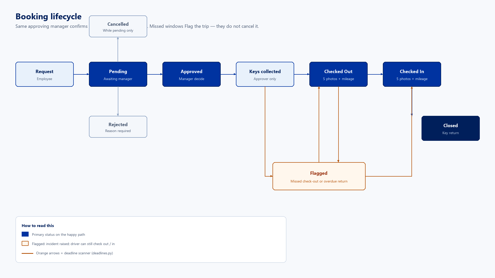

# Architecture tour

Local prototype for Group Forensic Services pool-vehicle booking: request, manager approval, key handover, photo check-out/check-in, and an audit trail. FastAPI serves both the JSON API and the Bootstrap HTML portals from one process.

| Backend | Database | Frontend | Sessions |
|---------|----------|----------|----------|
| FastAPI | SQLite | Vanilla JS + Bootstrap | In-memory tokens |

## Best first change

Start on the employee request vertical slice:

`app/static/app/request.html` → `app/routes/bookings.py` → `app/services/booking.py` (`request_booking`)

That path teaches routing, validation, conflict checks, audit, and the simulated email log without touching Azure cutover stubs.

## How to run

From the repo root, create a venv, install deps, seed demo users, then start Uvicorn. Open http://127.0.0.1:8000/login.html and pick a demo user (no password). Manager `nishen` and Admin `neo` share `/admin` permissions.

| Step | Command |
|------|---------|
| Venv (Windows) | `.venv\Scripts\activate` |
| Install | `pip install -r requirements.txt` |
| Seed / reset | `python seed.py --reset` |
| Run | `uvicorn app.main:app --reload --host 127.0.0.1 --port 8000` |
| Schema tests | `pytest -q` |

Live workflow test `tests/test_live_workflow.py` expects a server on port 8001, not 8000. Schema tests in `tests/test_validation.py` run without a server.

## Azure cutover (already stubbed)

| Concern | Swap this module |
|---------|------------------|
| Database URL | `app/config.py` (`DATABASE_URL`) |
| Auth / Entra ID | `app/services/auth.py` |
| Photo storage | `app/services/storage.py` |
| Email / Graph | `app/services/email.py` |

---

## Architecture

One FastAPI app serves static HTML and `/api/*`. Routers stay thin; booking rules live in services. A background `deadline_loop` started in `lifespan` flags missed check-out and overdue return windows every 60s.

Vector original: [architecture.svg](docs/images/architecture.svg) · source: [architecture.mmd](docs/images/architecture.mmd)

### Portals

`/app` is the employee surface (vehicles, request, trips, check-out, check-in). `/admin` is the manager surface (approvals, keys, incidents, analytics, vehicles, emails, audit). Shared chrome and `fetch` live in `app/static/js/api.js`. Camera capture is `app/static/js/camera.js` via `getUserMedia`.

### Domain model

Core tables: Users, Vehicles, Bookings, Incidents, AuditLog, NotificationsLog. Booking is the aggregate: status, keys, mileage, GPS, photo paths, and deadlines all sit on one row. Vehicles are soft-deactivated (`IsActive`). `TrackerData` and `ServiceHistory` exist but have no API yet.

Auth is a process-memory token map (`token → UserID`) in `app/services/auth.py`. The browser stores the token in `localStorage` and sends `X-Session-Token`. Manager and Admin are the same permission set (`is_manager_portal`).

### Layers

| Layer | Role | Files |
|-------|------|-------|
| UI | Bootstrap pages + session in localStorage | `app/static/**` |
| HTTP | Auth, RBAC, DTO mapping | `app/routes/*.py`, `app/main.py` |
| Domain | State machine, conflicts, photos, flags | `app/services/booking.py`, `deadlines.py` |
| Adapters | Sessions, files, simulated email, audit | `auth.py`, `storage.py`, `email.py`, `audit.py` |
| Data | SQLAlchemy 2.0 + `create_all` | `app/models/models.py`, `database.py` |

---

## Booking flow

Happy path is a six-step handshake between employee and the approving manager. Missed windows do not cancel the trip — they Flag it and raise an Incident. The same approver must confirm both key handover and key return.

Vector original: [booking-flow.svg](docs/images/booking-flow.svg) · source: [booking-flow.mmd](docs/images/booking-flow.mmd)

| Step | Who | Endpoint | Gate |
|------|-----|----------|------|
| 1. Request | Employee | `POST /api/bookings` | Purpose + destination; Immediate only if Available |
| 2. Decide | Manager | `POST /api/bookings/{id}/decide` | Auto-rejects overlapping pending requests |
| 3. Key out | Approver | `POST /api/bookings/{id}/key-collected` | Starts check-out deadline (`TRIP_WINDOW_HOURS`) |
| 4. Check-out | Driver | `POST /api/bookings/{id}/check-out` | 5 photos + mileage ≥ current + GPS text |
| 5. Check-in | Driver | `POST /api/bookings/{id}/check-in` | 5 photos + mileage ≥ check-out; optional damage |
| 6. Key return | Approver | `POST /api/bookings/{id}/key-returned` | Status → Closed; vehicle syncs to Available |

**Flagged, not cancelled.** `app/services/deadlines.py` scans every 60 seconds. After key collection, a missed check-out or overdue return opens an Incident and sets `BookingStatus` to Flagged. The driver can still complete check-out/check-in.

Approvals are sorted by borrowing record (Good → Fair → Poor, then FIFO) in `list_pending_sorted`.

---

## Key files

Read these in order if you are new: config and models first, then the booking service, then the two portals.

| File | Why it matters |
|------|----------------|
| `app/main.py` | App factory, static mounts, deadline task, HTML routes |
| `app/config.py` | DB path, trip window, photo angles, session header |
| `app/models/models.py` | ORM: User, Vehicle, Booking, Incident, Audit |
| `app/services/booking.py` | Entire booking state machine |
| `app/services/deadlines.py` | Missed-window scanner |
| `app/services/auth.py` | Mock sessions; Entra ID swap point |
| `app/routes/bookings.py` | Employee + manager booking HTTP API |
| `app/routes/admin.py` | Dashboard, incidents, audit, analytics |
| `app/schemas/schemas.py` | Pydantic validation (photos, purpose, damage) |
| `app/static/js/api.js` | Token header, nav chrome, `requireAuth` |
| `app/static/js/camera.js` | `getUserMedia` + geolocation |
| `seed.py` | Demo users, vehicles, historical closed trips |

### Frontend map

**Employee** (`app/static/app/`): `index.html` (vehicles), `request.html`, `trips.html`, `checkout.html`, `checkin.html`

**Manager** (`app/static/admin/`): dashboard, approvals, keys, incidents, analytics, vehicles, emails, audit

---

## Improvements

Ranked by leverage for a prototype heading toward Azure. High items block a real deployment; medium items will hurt once data volume or concurrency grows; low items are polish.

### High

| Area | What is wrong | Where |
|------|---------------|-------|
| Auth | No password; tokens live in a process dict and die on restart. HTML pages are public; only the API checks role. | `app/services/auth.py`, `app/main.py` |
| Photo privacy | `/uploads` is a public StaticFiles mount. Anyone with a path can fetch check-out photos. | `app/main.py`, `app/services/storage.py` |
| Tests | pytest only covers Pydantic schemas. The real workflow test needs a live server on port 8001. | `tests/test_live_workflow.py` |
| User enumeration | `GET /api/auth/users` is unauthenticated and returns every demo account for the login dropdown. | `app/routes/auth.py` |

### Medium

| Area | What is wrong | Where |
|------|---------------|-------|
| String statuses | `BookingStatus`, vehicle status, and `FlagType` are free strings. Typos will not fail at import time. | `app/models/models.py`, `booking.py` |
| Booking god table | Keys, GPS, photos (JSON text), deadlines, and damage all live on Bookings. Hard to evolve independently. | `app/models/models.py` |
| Analytics scan | `/api/admin/analytics` loads every booking and incident into Python and aggregates in a loop. | `app/routes/admin.py` |
| No migrations | `init_db()` is `create_all` only. Azure SQL cutover will need Alembic (or equivalent) before schema changes. | `app/database.py` |
| In-process scanner | `deadline_loop` runs inside Uvicorn. Multiple workers would double-flag; a crash pauses enforcement. | `app/main.py`, `deadlines.py` |

### Lower effort, still worth it

| Area | What is wrong | Where |
|------|---------------|-------|
| Port mismatch | README runs `:8000`; login error text and live test use `:8001`. | `README.md`, `login.html`, `test_live_workflow.py` |
| `datetime.utcnow` | Deprecated naive UTC across models and services; timezone bugs when clients send offsets. | `booking.py`, `models.py`, `deadlines.py` |
| Dead schema | `ServiceHistory` and `TrackerData` have models and seed rows but no routes. `ServiceHistoryOut` is unused. | `app/models/models.py`, `schemas.py` |
| Manager vs Admin | Roles are distinct in the UI but `is_manager_portal` treats them as identical. | `app/services/auth.py` |
| Unused cookie name | `SESSION_COOKIE` is defined; the client only sends `X-Session-Token` from localStorage. | `app/config.py`, `api.js` |
| Base64 photos | Five JPEG data URLs travel in JSON. Multipart + server-side store would shrink payloads. | `camera.js`, `storage.py`, `schemas.py` |

### Suggested first PRs

1. Convert the live workflow script to FastAPI `TestClient` so CI can exercise request → approve → keys → check-out → check-in → close.
2. Add a `BookingStatus` enum and use it in `booking.py`.
3. Gate `/uploads` behind the same session as the API.
